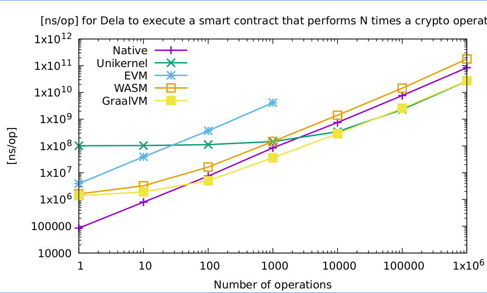

# d-exec
[](https://github.com/dedis/d-exec/actions/workflows/go_test.yml)

Contains experimental execution examples for DELA

## Run benchmarks:
For the benchmarks using an increment on a TCP server, you'll need to build and 
start the TCP server from within the javavm/graalvm_tcp_server directory using:
```bash
gradle run --args="mul"
```

Please read the `README.md` in the javavm directory for more details.

To start a particular benchmark, use one of the following commands from within goland:
```bash
go test -benchmem -run=^$ -bench ^BenchmarkNative_Increment$ ./benchmark/...
go test -benchmem -run=^$ -bench ^BenchmarkEVMLocal_Increment$ ./benchmark/...
go test -benchmem -run=^$ -bench ^BenchmarkNative_EC$ ./benchmark/...
go test -benchmem -run=^$ -bench ^BenchmarkEVMLocal_EC$ ./benchmark/...
go test -benchmem -run=^$ -bench ^BenchmarkGraalvmTCP_Increment$ ./benchmark/...
go test -benchmem -run=^$ -bench ^BenchmarkGraalvmTCP_ScalarMultiply$ ./benchmark/...
go test -benchmem -run=^$ -bench ^BenchmarkLocalTCP_Increment$ ./benchmark/...
go test -benchmem -run=^$ -bench ^BenchmarkUnikernelTCP_Increment$ ./benchmark/...
go test -benchmem -run=^$ -bench ^BenchmarkEVMTCP_Increment$ ./benchmark/...
```

## Latest benchmark

See [goland/benchmark/Report.md](goland/benchmark/Report.md).

Code version: v0.0.2

Result:



---


This project has received funding from the European Union's Horizon 2020 
research and innovation programme under grant agreement No 825377.